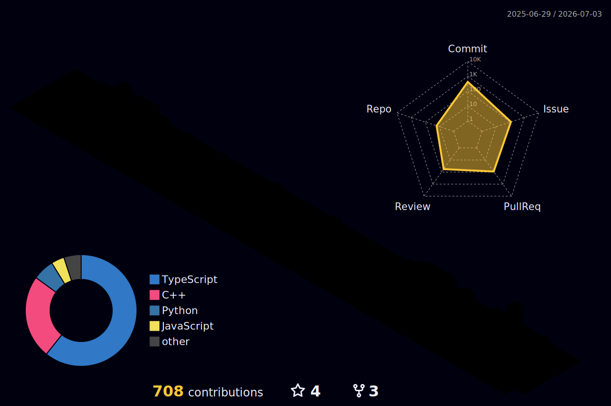

### Hello, hope your are fine! thank you for visiting my profile 👋

I'm Lourdu Radjou (Lou), a final year Computer science bachelors student studying at PTU Puducherry, India.

- I’m currently working on improving and contributing to **Wagtail CMS**
- I’m looking to collaborate on open-source software (OSS) projects and meaningful dev tools
- I’m currently learning Django and deeper Python backend development and my favourite books
- Contact me: rajlourdu15@gmail.com

<!--  -->

## Wanna connect with me:
   

